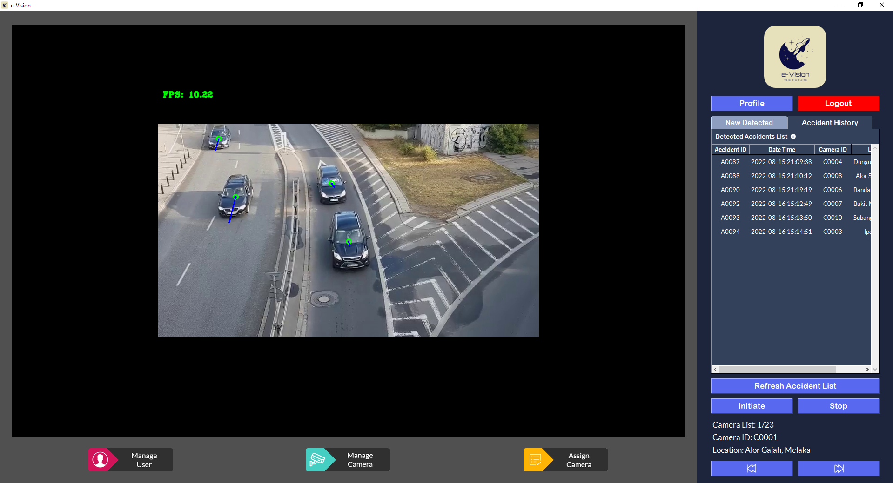
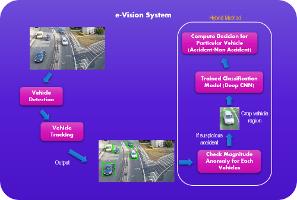
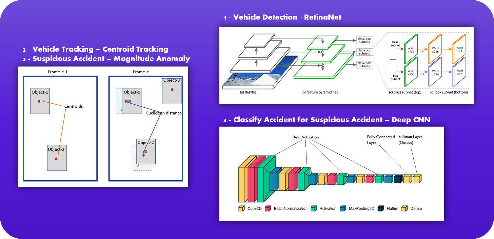

# e-Vision: Traffic Accident Detection System

  

Individual Final Year Project (FYP) for degree programme at Asia Pacific University (APU). A computer vision-based system that able to automatically detect for traffic accidents throughout the CCTV sources by utilizing CUDA technology and provide immediate report to the responsible authority. Equipped with a graphical desktop interface that provide the convenient usage for interacting with the system to utilize the functionalities provided. In addition, a web view functionality was provided for the remote reviewing usage of the detected accident. The overall core features of the e-Vision system are as following.

<ul>
  <li>Automatic traffic accident detection</li>
  <li>Record detected accident with evidence images</li>
  <li>Notify detected accident to person in charge</li>
  <li>Review detected accident</li>
  <li>Revise accident records that had been reviewed</li>
  <li>Remote review detected accident (through web application)</li>
  <li>User management</li>
  <li>Camera source management & allocation</li>
</ul>

## Technical Approach Implementation

  

Instead of directly processing entire image frame to detect for traffic accidents, e-Vision implemented vehicle detection, vehicle tracking and accident detection phases in order to track every individual vehicle from the CCTV footage to monitor for accidents occurance. It cannot completely agreed that tracking individual vehicle able to provide more advantages as compared to processing entire frame because it depends on what kind of scenario that the system dealing with. However, such approach able to effectively track distinct vehicles that exist within the frame image with a great performance result.

## Algorithms & Techniques Implementation

  

As the problems involved real time scenarios, single stage detector was preferred due to its speed performance. In this context, RetinaNet was implemented for the vehicle detection part due to its fascinating speed while maintaining a good overall accuracy. Initially, YOLO algorithm was chosen but was later replaced with RetinaNet due to its balancing within accuracy and speed.

Due to the time limitation of the project, a simpler tracking algorithm which known as centroid tracking was implemented for the vehicle tracking part over a standard algorithm such as DeepSORT. Since Euclidean distance was involved within this phase, the magnitude of the detected vehicle vector was able to be generated which used for the accident detection part.

In order to enhance the accident detection process, the model will process the magnitude anomaly for each individual vehicles over the frames. If the particular vehicle exceed the pre-defined threshold, the vehicle will be marked as suspicious accident which will further cropped and send to the deep CNN model to compute accident classification. Overall, all the sub-models created will be integrated together to enable the automated traffic accident detection task.

## Performance Evaluation
<table>
  <tr>
    <th></th>
    <th>Detected Accident</th>
    <th>Detected Non-Accident</th>
  </tr>
  <tr>
    <td>Actual Accident</td>
    <td>14</td>
    <td>3</td>
  </tr>
  <tr>
    <td>Actual Non-Accident</td>
    <td>2</td>
    <td>4</td>
  </tr>
</table>

A total of 23 video sources including 17 accident cases and 6 non-accident cases were fetched to the system. 14 out of 17 accident cases were completely processed successfully by the model, while 4 out of 6 non-accident cases were completely processed successfully. An overall accuracy of 78.26% was able to be achieved by the model which can consider as quite high.

## Limitations & Potential Future Improvements
Limitations Identified:
<ul>
  <li>False rate for vehicle that is facing towards the camera and near the screen edges</li>
  <li>Occlusion issue for tracking vehicle might happened especially in low light scenario condition</li>
  <li>Weak security protection for cloud storage (as per free)</li>
</ul>
Potential Future Improvements:
<ul>
  <li>Increase training data with various scenario environment (Current - 5000 training image only)</li>
  <li>Apply industry standard object tracking algorithm (exp: DeepSORT)</li>
  <li>Apply high authentication cloud storage services that usually required payment (exp: Amazon EC2, Bitbucket Storage, etc)</li>
</ul>

## Libraries Utilized
<ul>
  <li>OpenCV v4.5.5</li>
  <li>Keras v2.2.4 (with Tensorflow-GPU v1.13.1)</li>
  <li>Tkinter v8.6</li>
  <li>Pillow v9.1.1</li>
  <li>PyMySQL v1.0.2</li>
  <li><a href="https://github.com/fizyr/keras-retinanet">Keras RetinaNet</a></li>
</ul>

## Setup Requirements & Installation Guide
*** Please check the <a href="./Z-e-Vision Installation Setup Guidance.docx">installation guide file</a> for complete info. If the model file was corrupted, please check <a href="./Z-Source Note.txt">source file</a> to obtain the resources.
