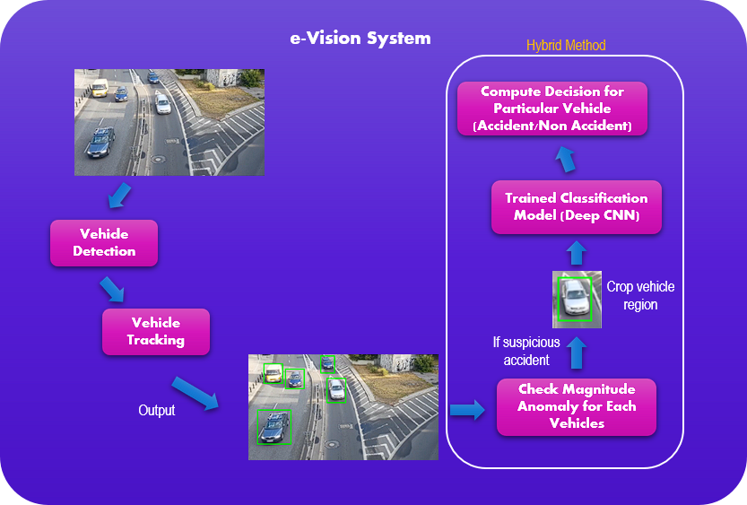

# e-Vision: Traffic Accident Detection System
Individual Final Year Project (FYP) for Asia Pacific University (APU). A computer vision-based system that able to automatically detect for traffic accidents throughout the CCTV sources and provide immediate report to the responsible authority. Equipped with a graphical desktop interface that provide the convenient usage for interacting with the system to utilize the functionalities provided. In addition, a web view functionality was provided for the remote reviewing usage of the detected accident. The overall core features of the e-Vision system are as following.
1) Automatic traffic accident detection
2) Record detected accident with evidence images
3) Notify detected accident to person in charge
4) Review detected accident
5) Revise accident records that had been reviewed
6) Remote review detected accident (through web application)
7) User management
8) Camera source management & allocation

## Technical Approach Implementation

  

Instead of directly processing entire image frame to detect for traffic accidents, e-Vision implemented vehicle detection, vehicle tracking and accident detection phases in order to track every individual vehicle from the CCTV footage to monitor for accidents occurance. It cannot completely agreed that tracking individual vehicle able to provide more advantages as compared to processing entire frame because it depends on what kind of scenario that the system dealing with. However, such approach able to effectively track distinct vehicles that exist within the frame image with a great performance result.

## Algorithms & Techniques Implementation

  

